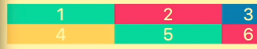
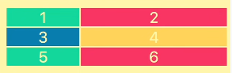
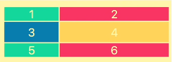
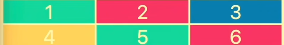

  
1

  
2

  
3

  
4

  
5

<h2>gird-template-columns:200px 200px 100px;</h2>

gird-template-columns আমারে যে কয় টা কলাম এর সাইজ বলে দিবো সেই কয়টা কলাম শো করবে 

output:

<h2>gird-gap:</h2>  row এবং কলাম এর মাঝে সমান পরিমান গ্যাপ দিবে
<h2>gird-template-columns:1fr 2fr;</h2>
এইটা বুটস্ট্র্যাপ এর কলাম মতো কাজ করে 

<h2>gird-template-rows:2fr 3fr;</h2>
এইটা row বরাবর কাজ করে প্রথম ২ টা row ডিক্লেয়ার করে দিছি বাকি টা অটোমেটিক নিয়ে নিচে  

<h2>gird-template:repeat(3,1fr)/repeat(3,1fr)</h2>
সমান row এবং কলাম নিয়ে কাজ করার জন্য এইভাবে লেখা যায়। প্রথম টি row হিসাবে কাজ করে দ্বিতীয় টি কলাম হিসাবে কাজ করে 

