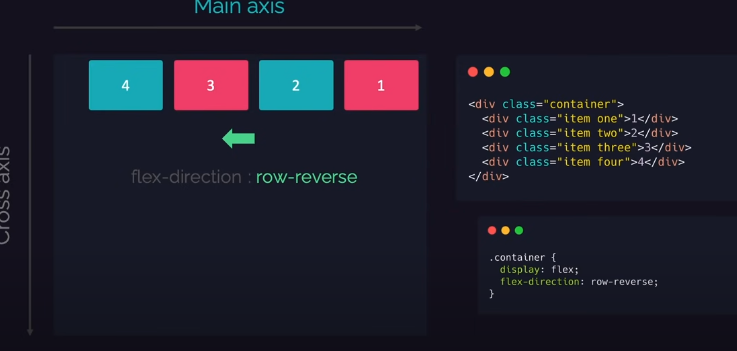
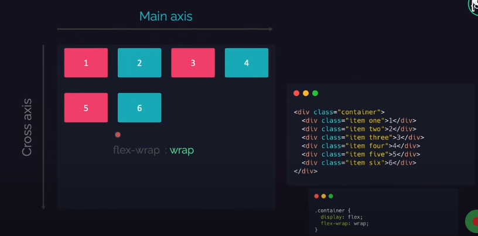
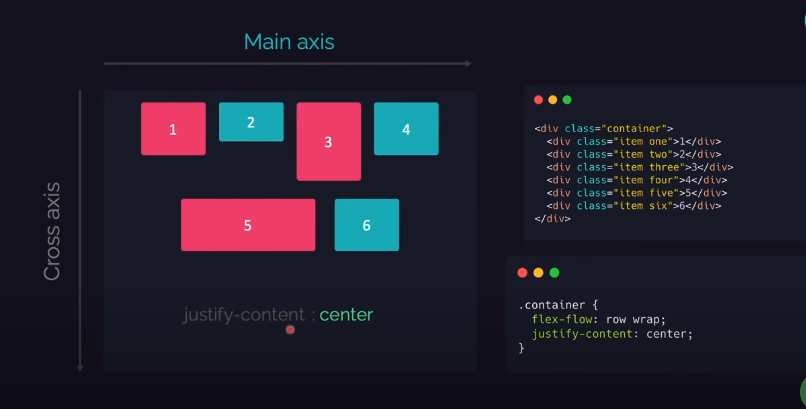
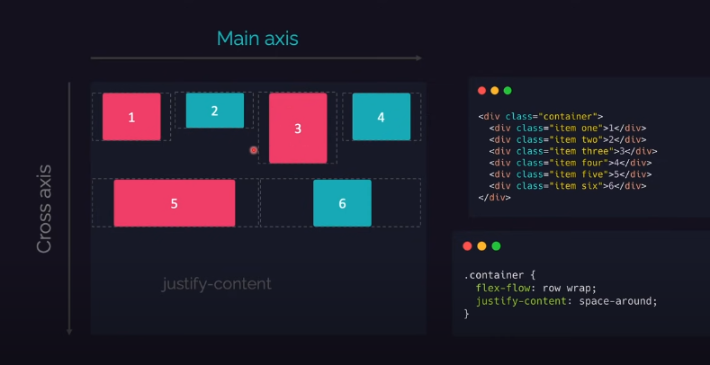
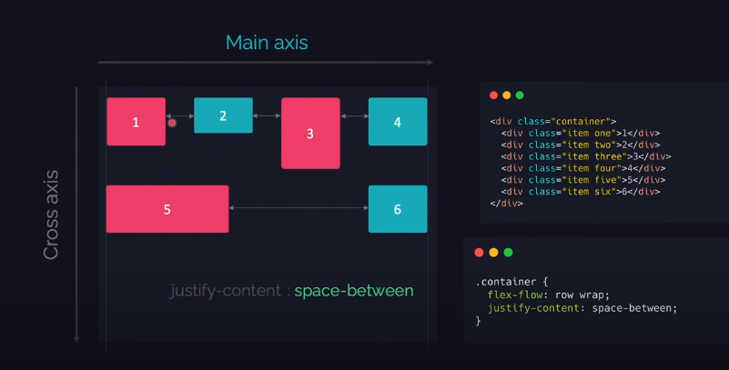
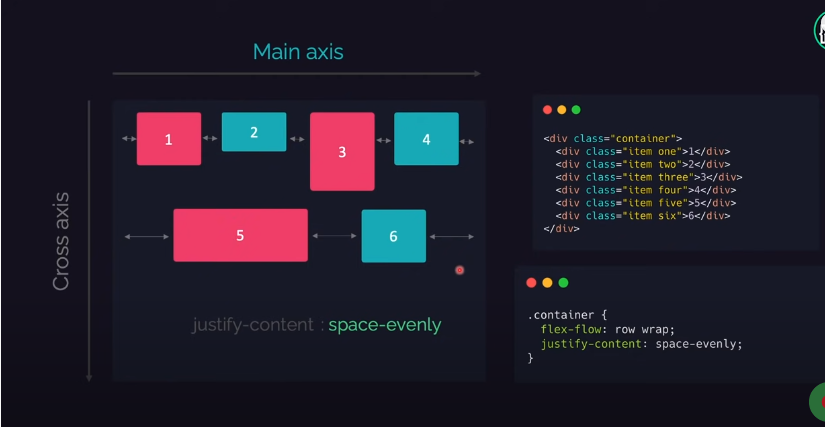
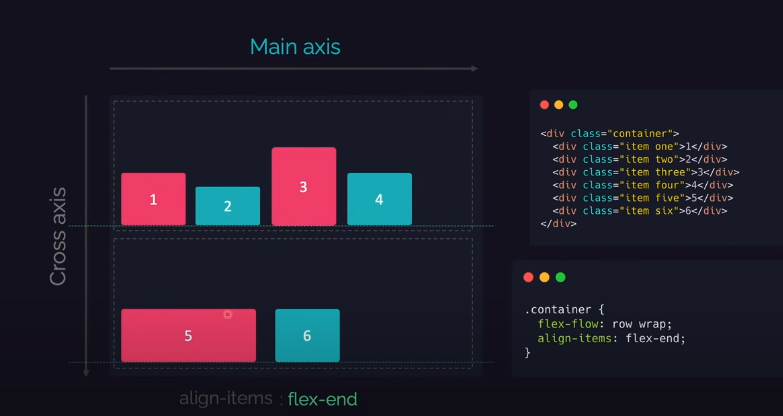

flex-direction: row | row-reverse | column | column-reverse;

flex-wrap: nowrap | wrap | wrap-reverse;

 flex-flow: column wrap;

 justify-content: flex-start | flex-end | center | space-between | space-around | space-evenly | start | end | left | right ... + safe | unsafe;

align-items: stretch | flex-start | flex-end | center | baseline | first baseline | last baseline | start | end | self-start | self-end + ... safe | unsafe;

align-content: flex-start | flex-end | center | space-between | space-around | space-evenly | stretch | start | end | baseline | first baseline | last baseline + ... safe | unsafe;

  flex-wrap:row wrap
  flex-grow:1;
  flex-flow:row wrap;

  আইটেম এ কোনো জাইগা গ্যাপ বা খালি থাকলে flexgrow  ১ দিলে এইটা ফিল up করে নেই 
  
  align-self:center; যে আইটেম এ এইটা কল করবে ওনলি সেই আইটেম টা সেন্টার এ যাবে 
  align-self:flex-end;

parent-box>*{
 flex-basis:100%;
}

flex:1 এইটা কলাম এর width  মতো কাজ করে এইটা দিয়া সহজে লেআউট তৈরি করা যায় 
 parent-box>* এইটা কলাম এর মতো কাজ করে যত গুলো div তা অটোমেটিক সাইজ নিয়ে নিবে 

.child1{
  flex:1;
}
.child2{
  flex:3;
}

order:1
order:2

যার অর্ডার কম সে আগে শো করবে আর যাদের অর্ডার বেশি সে পরে শো করবে 
flex-basis:100px;

এইটা রেস্পন্সিভ এর জন্য ঠিকমতো কাজ করে যে পরিমান width নেওয়ার কথা টিক সেই পরিমান width এ নেই এইটা 

.container {
  display: flex;
  ...
  gap: 10px;
  gap: 10px 20px; /* row-gap column gap */
  row-gap: 10px;
  column-gap: 20px;
}

diplay:flex 

output:

flex-direction:row-reverse

flex-direction:column-reverse

flex-wrap:wrap

justify-content:flex-end

justify-content:center

justify-content:space-around

justify-content:space-btween

justify-content:space-evenly

align-items::stretch

align-items::flex-end

align-items::center

