
diplay:flex 

output:

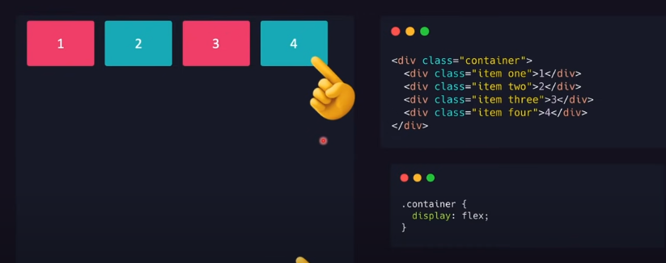

flex-direction:row-reverse

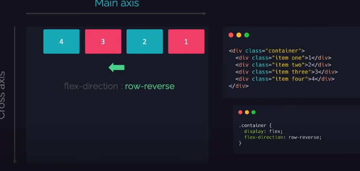

flex-direction:column-reverse

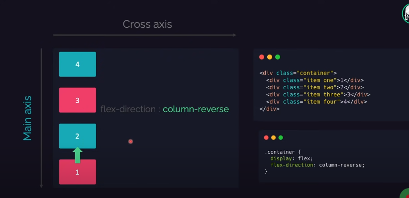

flex-wrap:wrap

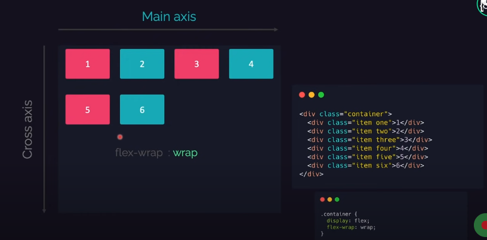

justify-content:flex-end

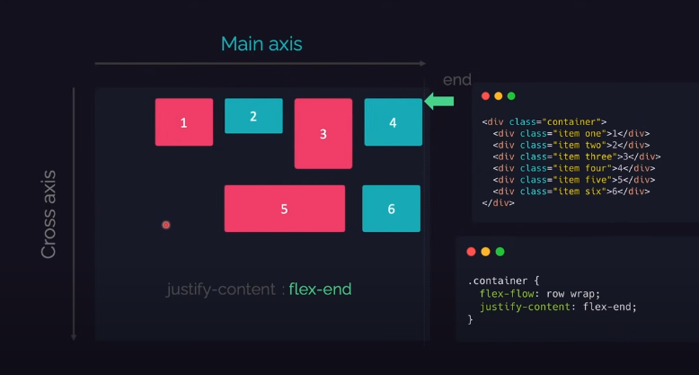

justify-content:center

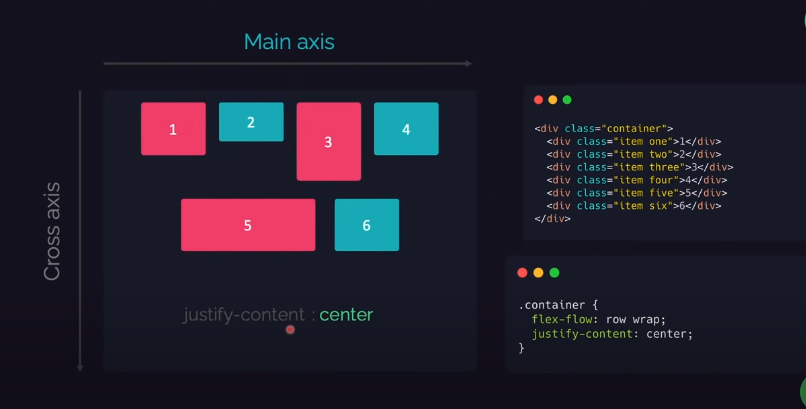

justify-content:space-around

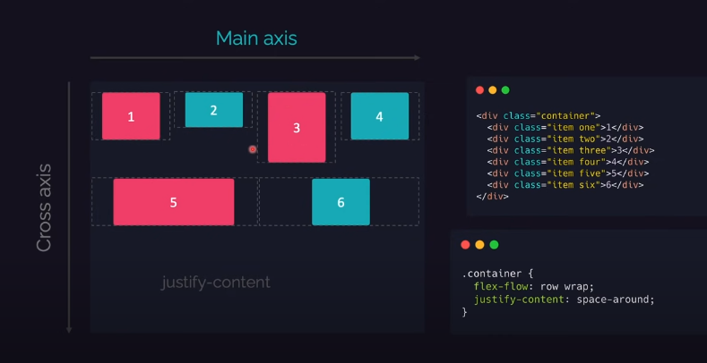

justify-content:space-btween

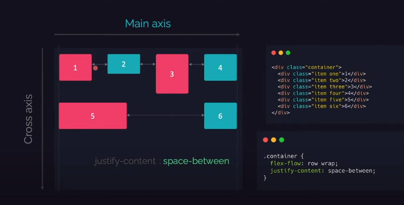

justify-content:space-evenly

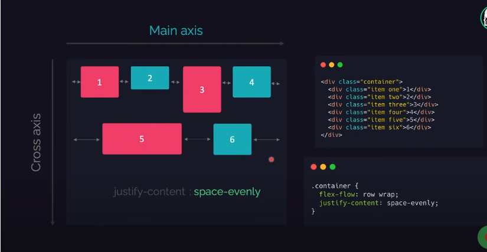

align-items::stretch

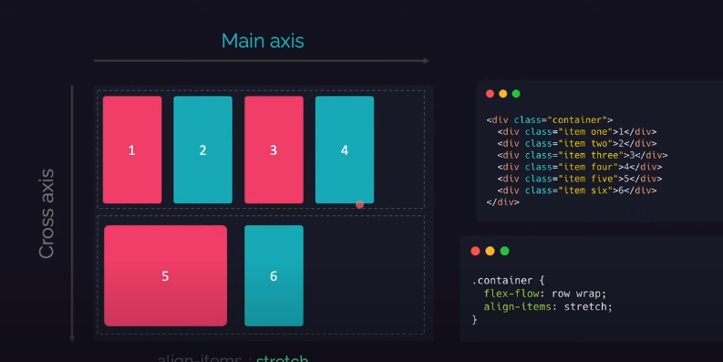

align-items::flex-end

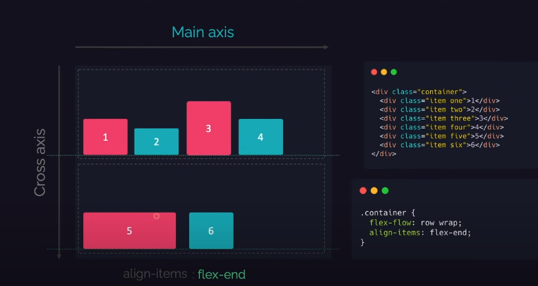

align-items::center

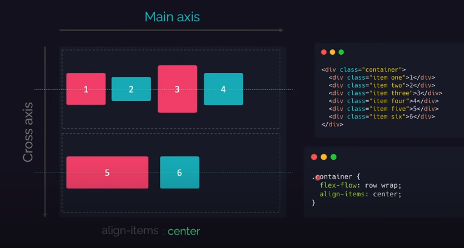

justify-content: flex-start|flex-end|center|space-between|space-around|space-evenly|initial|inherit;

